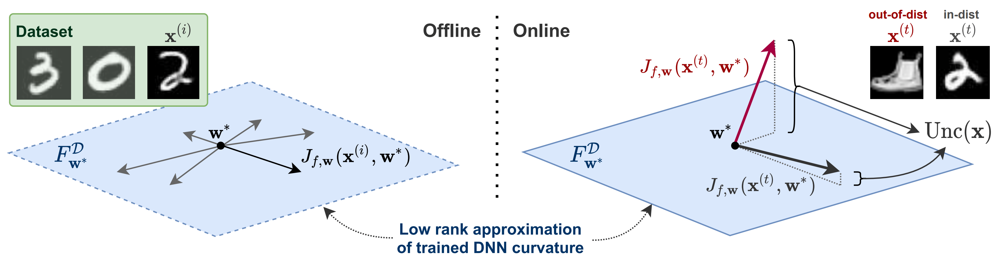

# SCOD-Regression
An implementation of Sketching Curvature for Efficient Out-of-Distribution Detection for Deep Neural Network (SCOD, [paper](https://arxiv.org/abs/2102.12567)) **regression tasks** in the form of a wrapper that can be applied to any PyTorch model.




## Overview
Notable modifications to the [original repository](https://github.com/StanfordASL/SCOD) are made to support batched pre-processing and inference mechanics leveraging [functorch](https://pytorch.org/functorch/stable/). 
This results in **processing speeds upwards of 10x**, extending SCOD's use from a test-time OoD detection system to an effective train-time module.


## Setup

### System Requirements
Tested on Ubuntu 16.04, 18.04 and macOS Monterey with Python 3.7.

### Installation
This package can be installed via pip as shown below.

```bash
git clone https://github.com/agiachris/scod-regression.git
cd scod-regression && pip install .
```


## Usage

### Background
In a nutshell, scod-regression produces two related measures of epistemic uncertainty. 
Several assumptions are currently built into the code-base that may be restrictive for some applications.
We refer the reader to the [original repository](https://github.com/StanfordASL/SCOD) should your use-case require a larger support of likelihood functions or prior distributions.
- **Posterior Predictive Variance.** 
Our algorithms are designed for multi-dimensional regression tasks; we thereby assume a Gaussian likelihood function with unit-variance. 
Analytic solutions to the Gaussian-distributed posterior weight and predictive distributions are derived by imposing a Gaussian isotropic prior over the neural network weights.
The predictive variance quantifies the model's epistemic uncertainty.
- **Local KL-Divergence.**
Under these guiding assumptions, we compute the expectation of the local KL-divergence in the output distribution over delta weight perturbations by integrating over the posterior distribution. 
This offers an uncertainty metric akin to the curvature of output distribution manifold under small weight perturbations - the curvature is proportional to the Fischer Information Matrix (FIM). 

### Example: Offline Reinforcement Learning
We provide an example of quantifying Q-network epistemic uncertainty in offline reinforcement learning, where the dataset returns off-policy transitions `(s, a, r, s')` as dictionaries. 

```python 
import torch
from scod_regression import SCOD

# Instantiate model, dataset, test-sample, etc.
device = torch.device("cuda" if torch.cuda.is_available() else "cpu")
q_network = ContinuousMLPCritic().to(device)

dataset = DatasetClass()
input_keys = ["states", "actions"]
dataloader_kwargs = {"batch_size": 128, "shuffle": True}

test_sample = dataset.__getitem__()
for k, v in test_sample.items():
    if torch.is_tensor(v):
        test_sample[k] = v.unsqueeze(0).to(device)

# SCOD config
config = {
  "output_dist": "NormalMeanParamLayer",
  "sketch": "SRFTSinglePassPCA",
  "num_eigs": 50,
}

# (1) Wrap Q-Network with SCOD
scod = SCOD(q_network, config=config, device=device)

# (2) Pre-compute posterior quantities over in-distribution samples
scod.process_dataset(dataset, input_keys, dataloader_kwargs=dataloader_kwargs)

# (3) Compute out-of-distribution metrics on a test sample
q_values, post_pred_var, local_kl = scod(test_sample, input_keys, detach=False)
```

### Instructions
The SCOD class is made accessible by scod-regression and can be used in three simple steps: (1) wrap the PyTorch model (nn.Module) with SCOD; (2) pre-compute the posterior quantities over a dataset of *in-distribution* samples; (3) compute *out-of-distribution* metrics (and model outputs) over test samples.

#### SCOD Configuration
The two recommended ways to configure SCOD is (a) the rank-*k* decomposition of the dataset FIM and (b) the matrix sketching techniques used to embed the FIM in a memory efficient form.
These correspond to `"num_eigs"` and `"sketch"` keys in a config dictionary passed to SCOD during instantiation.

#### Dataset Pre-processing
The `process_dataset()` expects a PyTorch `Dataset` or `IterableDataset` returning inputs and targets in the following forms:
- `torch.Tensor`: The single tensor is assumed a model input (target is None);
- `List[torch.Tensor]` or `Tuple[torch.Tensor, ...]`: Iterables that may recursively contain Iterables of Tensors are flattened into a list of tensors:
    - Setting the argument `inputs_only` (default: False) interprets the entire list as model inputs, instead of assigning the last tensor to the target;
- `Dict[str, torch.Tensor]`: `input_keys` and `target_key` arguments can be set to extract the input and target tensors for a given task.

**Important note:** targets are optional, only used when SCOD is configured with `"use_empirical_fischer": True`, and is not necessary to obtain high-quality uncertainty metrics.

#### Uncertainty Quantification
SCOD subclassses nn.Module and implements a `forward()` function. 
By default, calling it on a batch of test samples computes (in parallel) the model's outputs (B x d), the posterior predictive variances (B x d), and the local KL-divergences (B x 1). For increased efficiency, the `mode` argument can be set to the sole desired uncertainty quantity: `mode=1` for variance and `mode=2` for KL-divergence.

The uncertainty metrics' connection to the computation graph can be maintained by specifying `detach=False`, supporting differentiability of downstream, uncertainty-informed objectives through SCOD. 


## Citation
This repository has an MIT [License](https://github.com/agiachris/scod-regression/blob/main/LICENSE). If you find this package helpful, please consider citing:
```
@inproceedings{sharma2021sketching,
  title={Sketching curvature for efficient out-of-distribution detection for deep neural networks},
  author={Sharma, Apoorva and Azizan, Navid and Pavone, Marco},
  booktitle={Uncertainty in Artificial Intelligence},
  pages={1958--1967},
  year={2021},
  organization={PMLR}
}
```
